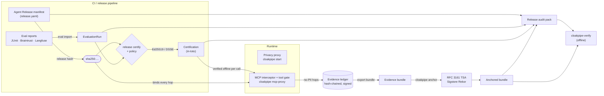

<div align="center">

# CloakPipe

**The reliability layer for AI agents.**

CloakPipe is the verifiable control plane for production AI agents:<br>
evaluate a release, certify it, enforce it at runtime, and prove what happened.

[](https://github.com/rohansx/cloakpipe/actions/workflows/ci.yml)
[](LICENSE)
[](https://github.com/rohansx/cloakpipe/releases)
[](https://github.com/rohansx/cloakpipe)
[](https://cloakpipe.co/docs)

[Website](https://cloakpipe.co) · [Docs](https://cloakpipe.co/docs) · [Quick start](#quick-start) · [Architecture](#architecture) · [Issues](https://github.com/rohansx/cloakpipe/issues)

</div>

---

## What is CloakPipe?

Agents in production need **evidence, not dashboards**. When an agent issues a
refund, reads a customer record or calls an MCP tool, you should be able to show
which exact release did it, what evidence that release was approved on, which
policy allowed the call, and that none of it was edited afterwards.

CloakPipe is an open-source Rust toolkit that does this end to end:

- An **Agent Release** manifest pins every behaviour-affecting component (code,
  prompts, model, parameters, tools, MCP servers, retrieval, policies, runtime
  image) and hashes to one canonical `sha256:` identity.
- Evaluation results from the tools you already use are bound to that hash and
  turned into a **deterministic, signed certification**.
- At runtime, a **privacy proxy** keeps PII away from model providers and an
  **MCP tool gate** refuses tool calls that the certified release does not allow.
- Every runtime decision lands in a **hash-chained, signed, PII-free evidence
  ledger** that can be anchored externally (RFC 3161, Sigstore Rekor) and
  verified **offline** by anyone with the public keys, without a CloakPipe account.

## Features

CloakPipe is organised around four pillars: **Evaluate → Certify → Enforce → Prove**.

| Pillar | What you get | Entry point |
|---|---|---|
| **Evaluate** | Import evaluation results as native, release-bound `EvaluationRun`s: **JUnit XML** (pytest, Jest, Go, JUnit, cargo-nextest), **Braintrust** experiments, **Langfuse** experiments (and legacy dataset runs). Score-based sources fail closed: an unscored case is an `error`, not a pass. | `cloakpipe eval import` |
| **Certify** | Immutable, canonically hashed release manifests with a material-change diff that tells you which assurance suites a change requires. A pure, deterministic policy engine (pass rate, coverage, regressions vs. baseline, critical failures, metric thresholds) produces a decision signed as an **in-toto v1 Statement in a DSSE envelope** (Ed25519), scoped to an environment and expiring. Ships as a **GitHub Action**. | `cloakpipe release …`, [`.github/actions/certify`](.github/actions/certify) |
| **Enforce** | **Privacy proxy**: OpenAI- and Anthropic-compatible HTTP proxy that detects PII, replaces it with consistent tokens, and restores originals in responses (including streaming), with an AES-256-GCM encrypted vault. **MCP interceptor**: masks PII in tool-call arguments and rehydrates results. **MCP tool gate**: only tools declared in the certified release run, and only while its certification verifies. | `cloakpipe start`, `cloakpipe mcp-proxy` |
| **Prove** | **Evidence ledger**: per-tenant hash chain of signed records that carry types, counts, hashes and references, never raw PII. **External anchoring** at an RFC 3161 TSA and Sigstore Rekor. **Release audit packs**: one signed JSON file with the manifest, runs, certifications, governance history and ledger exports. A **standalone verifier** with no dependency on any evidence producer. | `cloakpipe anchor`, `cloakpipe release audit-pack`, `cloakpipe-verify` |

## Architecture



Everything above is derived from one identifier, the **release hash**: runs
name it, certifications are about it, gated MCP hops carry it inside their
signed bytes, and the audit pack recomputes it from the embedded manifest.
A passing test of one configuration can never certify a different one.

<details>
<summary><b>Crate map</b> (Cargo workspace, <code>crates/</code>)</summary>

| Crate | Responsibility |
|---|---|
| [`cloakpipe-cli`](crates/cloakpipe-cli) | The `cloakpipe` binary: proxy, MCP, release, eval, anchor, audit-pack, scan and other commands. |
| [`cloakpipe-release`](crates/cloakpipe-release) | Agent Release manifests: schema, validation (immutable references only), RFC 8785 canonical hashing, material-change diff, in-toto Statement. |
| [`cloakpipe-cert`](crates/cloakpipe-cert) | `EvaluationRun` and `CertificationPolicy` models, JUnit/Braintrust/Langfuse importers, the deterministic `decide()` engine, DSSE signing and verification. |
| [`cloakpipe-core`](crates/cloakpipe-core) | Detection (regex + checksums, financial, optional ONNX NER), pseudonymization, encrypted vault, rehydration, sessions, industry profiles. |
| [`cloakpipe-proxy`](crates/cloakpipe-proxy) | Axum HTTP proxy: `/v1/chat/completions`, `/v1/messages`, `/v1/embeddings`, SSE streaming rehydration, session and CloakTree endpoints. |
| [`cloakpipe-mcp`](crates/cloakpipe-mcp) | MCP server exposing six privacy tools, and the MCP interceptor with the release tool gate and ledger recording. |
| [`cloakpipe-ledger`](crates/cloakpipe-ledger) | Verifiable evidence ledger: no-PII records, canonical encoding, per-tenant hash chain, Ed25519 signatures, bundle export, batch sealing. |
| [`cloakpipe-anchor`](crates/cloakpipe-anchor) | Merkle batching and inclusion proofs, RFC 3161 TSA and Sigstore Rekor clients. |
| [`cloakpipe-verify`](crates/cloakpipe-verify) | Standalone verifier for evidence bundles (chain, signatures, anchors, proofs, manifest) and release audit packs. Produces no evidence itself. |
| [`cloakpipe-audit`](crates/cloakpipe-audit) | Structured JSONL / SQLite audit log for the HTTP proxy (metadata only). |
| [`cloakpipe-tree`](crates/cloakpipe-tree) | CloakTree: vectorless, LLM-driven document retrieval over a local tree index. |
| [`cloakpipe-vector`](crates/cloakpipe-vector) | ADCPE distance-preserving embedding encryption (experimental). |
| [`cloakpipe-local`](crates/cloakpipe-local) | Placeholder for a fully local mode; not implemented. |
| [`cloakleak`](crates/cloakleak), [`cloakleak-cli`](crates/cloakleak-cli) | CloakLeak: an open PII-leak benchmark harness (prose and MCP `tool_json` tracks), run as a zero-leak gate in CI. |

</details>

## Quick start

### Install

CloakPipe builds with stable Rust. The agent-release commands (`release`,
`eval`, `anchor`, `audit-pack`) are on `main` and not yet in a tagged release,
so install from git:

```bash
cargo install --git https://github.com/rohansx/cloakpipe cloakpipe-cli --locked     # the `cloakpipe` CLI
cargo install --git https://github.com/rohansx/cloakpipe cloakpipe-verify --locked  # the offline verifier
```

Or build from a checkout:

```bash
git clone https://github.com/rohansx/cloakpipe && cd cloakpipe
cargo build --release -p cloakpipe-cli -p cloakpipe-verify   # binaries in target/release/
```

A container image of the **privacy proxy** is published to GHCR on every tag
(currently `v0.10.0`, which predates the agent-release commands):

```bash
docker run -p 8900:8900 -e OPENAI_API_KEY=sk-... ghcr.io/rohansx/cloakpipe:latest
```

### Certify a release in five commands

This walks the whole Evaluate → Certify → Prove path offline. Create three small files:

<details>
<summary><code>release.yaml</code>, <code>policy.yaml</code>, <code>report.xml</code></summary>

```yaml
# release.yaml: every reference must be immutable (no @latest)
apiVersion: cloakpipe.co/v1alpha1
kind: AgentRelease
metadata:
  agent: support-agent
  version: "1"
spec:
  code: {repository: acme/support, commit: 8fd29ac}
  prompts: [{ref: prompt:support-answer@31}]
  model: {ref: model:openai/gpt-5@2026-08-01}
  parameters: {temperature: 0.2}
  tools: [{ref: tool:lookup-customer@7}, {ref: tool:refund@4}]
  runtime:
    image: "registry.example.com/support-agent@sha256:9f86d081884c7d659a2feaa0c55ad015a3bf4f1b2b0b822cd15d6c15b0f00a08"
    region: eu-west
```

```yaml
# policy.yaml
apiVersion: cloakpipe.co/v1alpha1
kind: CertificationPolicy
name: support-prod
version: "1"
validityDays: 30
rules:
  maxNewCriticalFailures: 0
  minPassRate: 0.95
```

```xml
<!-- report.xml: any JUnit report (pytest --junitxml, Jest, Go, cargo-nextest, ...) -->
<testsuites>
  <testsuite name="privacy" tests="2">
    <testcase classname="privacy" name="no_pii_in_reply"/>
    <testcase classname="privacy" name="masks_account_numbers"/>
  </testsuite>
  <testsuite name="refunds" tests="1">
    <testcase classname="refunds" name="requires_identity"/>
  </testsuite>
</testsuites>
```

</details>

```console
$ cloakpipe release validate release.yaml
valid  sha256:236b3262…dbde4  support-agent@1

$ cloakpipe release keygen --out key.json          # Ed25519, written with mode 0600
{ "keyid": "ed25519:45b1f4442447eb18", "publicKey": "b9cecdea…" }

$ cloakpipe eval import --junit report.xml --release release.yaml \
    --suite support-critical@1 --covers privacy,functional --critical 'privacy::*' --out run.json

$ cloakpipe release certify release.yaml --policy policy.yaml --run run.json \
    --require privacy,functional --environment production --issuer ci:acme/support --key key.json
CERTIFIED
release   sha256:236b3262…dbde4  support-agent@1
policy    support-prod@1  sha256:3e2bb754…ab9a
required  functional, privacy
runs      1
envelope  release.cert.dsse.json

$ cloakpipe release verify-cert release.cert.dsse.json --trust key.json --release release.yaml
VALID
outcome    certified
release    sha256:236b3262…dbde4
certified  yes
```

Exit codes are CI-friendly: `0` certified / valid, `1` blocked or invalid, `2`
usage or I/O error. Two things worth trying next:

- Make `no_pii_in_reply` fail (add `<failure/>`) and re-import: `certify` prints
  `BLOCKED` with `new_critical_failure` and `pass_rate_below_minimum` and exits 1.
- Change `temperature` and verify again with `--release` pointing at the edited
  manifest: the certification is `INVALID` because the release hash no longer
  matches. `cloakpipe release diff release.yaml changed.yaml` shows which
  assurance suites the change requires.

### Run the privacy proxy

```bash
export OPENAI_API_KEY=sk-...            # upstream key that CloakPipe forwards with
cloakpipe start                          # writes cloakpipe.toml on first run; listens on 127.0.0.1:8900
curl http://127.0.0.1:8900/health        # {"service":"cloakpipe","status":"ok"}
export OPENAI_BASE_URL=http://127.0.0.1:8900/v1
```

Try detection without a proxy or API key:

```console
$ cloakpipe test --text "Send the refund to priya@acme.in, PAN BNZPM2501F"
--- Detected Entities (2) ---
  [Email] "priya@acme.in" (confidence: 100%, source: Pattern)
  [Custom("PAN")] "BNZPM2501F" (confidence: 100%, source: Pattern)

--- Pseudonymized ---
Send the refund to EMAIL_1, PAN PAN_1
```

## Usage highlights

### Certify in GitHub Actions

The composite action installs the CLI, runs `release certify`, writes a job
summary and exposes `outcome`, `envelope` and `decision` outputs. It fails the
job on a `BLOCKED` decision by default.

```yaml
- id: cert
  uses: rohansx/cloakpipe/.github/actions/certify@main
  with:
    manifest: release.yaml
    policy: certification-policy.yaml
    runs: |
      runs/support-critical.json
    baseline-manifest: releases/previous.yaml   # optional: diff sets the required suites
    baseline-runs: |
      runs/previous/support-critical.json
    environment: production
    signing-key: ${{ secrets.CLOAKPIPE_CERT_KEY }} # contents of a `release keygen` key file
```

All inputs: [`.github/actions/certify/README.md`](.github/actions/certify/README.md).

### Gate MCP tool calls on the certified release

`cloakpipe mcp-proxy` sits between an agent and an upstream MCP server (stdio).
It masks PII in tool-call arguments, rehydrates results, and with `--manifest`
admits a `tools/call` only if the tool is declared in the release and the
certification verifies **at the moment of the call** (trusted signer, not
revoked, inside its validity window, about this release, for this environment).

```bash
CLOAKPIPE_LEDGER_DB=./ledger.db \
cloakpipe mcp-proxy --upstream "npx -y @acme/crm-mcp" \
  --manifest release.yaml --certification release.cert.dsse.json \
  --trust key.json --environment production     # --gate warn to report instead of refuse
```

A refused call never reaches the tool. The agent receives a JSON-RPC error:

```json
{"jsonrpc":"2.0","id":2,"error":{"code":-32001,"message":"tool call refused by CloakPipe: undeclared_tool",
 "data":{"reason":"undeclared_tool","tool":"delete_account","release":"sha256:236b3262…"}}}
```

With `CLOAKPIPE_LEDGER_DB` set, every call, result and refusal is recorded as a
release-bound ledger hop. The gate fails closed on unparseable messages,
batches and non-canonical JSON-RPC member names. Details:
[docs/CERTIFICATION.md](docs/CERTIFICATION.md#runtime-the-mcp-tool-gate).

### Anchor and verify evidence offline

```bash
# Trust inputs (verify fingerprints out of band)
curl -sS https://freetsa.org/files/cacert.pem -o freetsa-root.pem
curl -sS https://rekor.sigstore.dev/api/v1/log/publicKey -o rekor.pub

# Seal an exported bundle under a signed Merkle batch head and anchor it at both services
cloakpipe anchor bundle.json --key key.json \
  --tsa-root freetsa-root.pem --rekor-key rekor.pub --out anchored.json

# Anyone can verify, with no network access
cloakpipe-verify all anchored.json --tsa-root freetsa-root.pem --rekor-key rekor.pub
```

Each Rekor submission is public and permanent; it contains a hash of the batch
head, a signature and the operator public key, never record content.
See [docs/ANCHORING.md](docs/ANCHORING.md).

### Hand a reviewer one file

```bash
cloakpipe release audit-pack --manifest release.yaml --run run.json \
  --certification release.cert.dsse.json --ledger-export ledger.json \
  --events events.json --key exporter.key.json --out release.audit-pack.json

cloakpipe-verify release-pack release.audit-pack.json \
  --trust exporter.key.json --ledger-trust ledger.pub.json --cert-trust key.json
# PASS  release audit pack for sha256:236b3262…
#   certification VALID certified production until 2026-11-06T17:56:29Z by ci:acme/support
#   ledger       bundle-ac3c4fc5812d: 10 record(s), 10 for this release …
# TIMELINE …
```

The verifier checks the pack signature, recomputes the release hash, verifies
every certification and ledger export against **separate** trust anchors per
role, and requires every production promotion to be covered by a certification
valid at that instant (or an explicit break-glass). See
[docs/AUDIT_PACK.md](docs/AUDIT_PACK.md).

<details>
<summary><b>Privacy proxy reference</b>: SDKs, detection, configuration, Docker</summary>

#### Point your SDK at CloakPipe

```python
from openai import OpenAI

client = OpenAI(base_url="http://127.0.0.1:8900/v1", api_key="sk-...")
client.chat.completions.create(
    model="gpt-4o",
    messages=[{"role": "user", "content": "Analyze the account for priya@acme.in, PAN BNZPM2501F"}],
)
# The provider sees EMAIL_1 and PAN_1; your app gets the original values back.
```

Anthropic Messages requests are served at `/v1/messages`. Each proxy forwards
to one upstream (`[proxy] upstream` and `api_key_env` in `cloakpipe.toml`), so
set `upstream = "https://api.anthropic.com"` and `api_key_env = "ANTHROPIC_API_KEY"`
and point the SDK at `base_url="http://127.0.0.1:8900"`. LangChain, LlamaIndex
and a Python client live in [`integrations/`](integrations).

#### How masking works

1. **Detect**: regex rules (emails, secrets/API keys, IPs, SSN,
   Aadhaar, PAN, prefixed IDs, license numbers, phone numbers when enabled),
   financial amounts and dates, custom TOML patterns, and optional ONNX NER.
2. **Pseudonymize**: each entity becomes a typed token (`EMAIL_1`, `PAN_1`).
   The same entity consistently maps to the same token, so the model keeps
   coherence across a conversation.
3. **Vault**: mappings are stored locally, encrypted with AES-256-GCM under
   `CLOAKPIPE_VAULT_KEY` (64 hex chars; an ephemeral key is generated if unset,
   and mappings then do not survive a restart).
4. **Rehydrate**: tokens in the response, including SSE streams, are replaced
   with the original values before your app sees them.

Optional NER backends (`[detection.ner] backend`): `distilbert_pii` (63 MB ONNX,
CPU), `bert`, `gliner`, `nemotron_pii` (ONNX, CPU), and `gliner_pii` via a Python
sidecar ([`tools/gliner-pii-server.py`](tools/gliner-pii-server.py)). NER is off
by default; the default build runs regex and heuristics with no model download.

#### Policies and profiles

Ready-made configs in [`policies/`](policies): `default`, `dpdp`, `gdpr`,
`hipaa`, `pci-dss`, `minimal`. Run one with `cloakpipe -c policies/dpdp.toml start`.
`cloakpipe setup` walks through industry profiles (general, legal, healthcare,
fintech). These are technical controls that support compliance programs; they
are not certifications.

#### Other commands

| Command | Purpose |
|---|---|
| `cloakpipe scan <dir>` | Mask `.txt`/`.md`/`.json`/`.csv` files before RAG indexing (`--detect-only` to report) |
| `cloakpipe mcp` | Run as an MCP server with six tools: `pseudonymize`, `rehydrate`, `detect`, `vault_stats`, `configure`, `session_context` |
| `cloakpipe sessions` | Inspect and flush context-aware pseudonymization sessions |
| `cloakpipe tree` | CloakTree: index a document and query it without embeddings |
| `cloakpipe vector` | ADCPE embedding encryption (experimental) |
| `cloakpipe stats` | Vault statistics |

#### Docker Compose

```bash
echo "OPENAI_API_KEY=sk-..." > .env
echo "CLOAKPIPE_VAULT_KEY=$(openssl rand -hex 32)" >> .env
docker compose up -d        # builds the repo Dockerfile; binds 0.0.0.0:8900; state in /data
```

</details>

## How CloakPipe fits

CloakPipe is designed to sit **alongside** the tools you already run, not
replace them:

- **Evaluation platforms** (Braintrust, Langfuse, test frameworks emitting
  JUnit) measure behaviour. CloakPipe imports their results, binds them to an
  exact release, and turns them into a signed, verifiable decision.
- **Guardrails and PII redaction libraries** act on individual requests.
  CloakPipe adds release identity, certification-aware tool gating, and a
  tamper-evident record of every decision.
- **Supply-chain tooling** (in-toto, DSSE, Sigstore) provides the formats and
  transparency logs CloakPipe builds on; CloakPipe applies them to agent
  releases and runtime evidence.

## Security model

<details open>
<summary><b>What is verified offline, and against what</b></summary>

| Artifact | Verified by | Trust inputs (never read from the artifact) |
|---|---|---|
| Release identity | Recomputing the canonical hash (RFC 8785 JCS, NFC). A stdlib-only Python reference ([`tools/release_hash_reference.py`](tools/release_hash_reference.py)) is checked against the Rust implementation in CI. | none |
| Certification | `cloakpipe release verify-cert`: DSSE signature, subject = release, validity window, decision, environment, local revocation lists | signer keys (`--trust`, `--trust-key`); `--revoked-statement`, `--revoked-key` |
| Evidence bundle | `cloakpipe-verify all`: hash chain, record signatures, batch heads, Merkle inclusion proofs, manifest | `--trust-key` for the signer |
| External anchors | RFC 3161: CMS signature, ESS cert binding, timeStamping EKU, path to a pinned root valid at `genTime`, nonce. Rekor: SignedEntryTimestamp, entry body, RFC 6962 inclusion proof, signed checkpoint. No record or batch head may postdate its anchor. | `--tsa-root`, `--rekor-key` |
| Release audit pack | `cloakpipe-verify release-pack`: pack signature, all of the above, event and promotion consistency | separate keys per role: `--trust`, `--cert-trust`, `--ledger-trust` |

Verification fails closed: a receipt without its trust input fails rather than
being skipped, and one key may not hold two roles in a pack.

</details>

**What is not guaranteed.** A certification proves that a named issuer applied
a named policy to named runs of an exact release; it does not prove the
evaluations measured the right property or that the release is safe outside
its scope. Governance events in an audit pack are attested only by the
exporter, and a pack does not prove completeness. Offline verification does not
check certificate revocation (CRL/OCSP) or Rekor log consistency between
checkpoints. PII detection is pattern- and model-based and can miss entities;
measure it on your own data (the CloakLeak harness in this repo is a starting
point). Full details: [CERTIFICATION.md](docs/CERTIFICATION.md#what-a-certification-does-not-claim),
[ANCHORING.md](docs/ANCHORING.md), [AUDIT_PACK.md](docs/AUDIT_PACK.md#what-a-pack-does-not-prove).

## Documentation

| Topic | In this repo | On the website |
|---|---|---|
| Agent Release manifests | [docs/AGENT_RELEASE.md](docs/AGENT_RELEASE.md), [schema](schemas/agent-release.schema.json) | [cloakpipe.co/docs/releases](https://cloakpipe.co/docs/releases) |
| Evaluation import | [docs/CERTIFICATION.md](docs/CERTIFICATION.md#cloakpipe-eval-import) | [cloakpipe.co/docs/evaluation](https://cloakpipe.co/docs/evaluation) |
| Certification and GitHub Action | [docs/CERTIFICATION.md](docs/CERTIFICATION.md) | [cloakpipe.co/docs/certification](https://cloakpipe.co/docs/certification) |
| Runtime and privacy proxy | this README | [cloakpipe.co/docs/runtime](https://cloakpipe.co/docs/runtime) |
| MCP tool gate | [docs/CERTIFICATION.md](docs/CERTIFICATION.md#runtime-the-mcp-tool-gate) | [cloakpipe.co/docs/mcp-gate](https://cloakpipe.co/docs/mcp-gate) |
| Evidence and anchoring | [docs/ANCHORING.md](docs/ANCHORING.md) | [cloakpipe.co/docs/evidence](https://cloakpipe.co/docs/evidence) |
| Release audit packs | [docs/AUDIT_PACK.md](docs/AUDIT_PACK.md) | [cloakpipe.co/docs/audit-pack](https://cloakpipe.co/docs/audit-pack) |
| Integrations, FAQ | [integrations/](integrations) | [integrations](https://cloakpipe.co/docs/integrations), [FAQ](https://cloakpipe.co/docs/faq) |
| Release history | [CHANGELOG.md](CHANGELOG.md) | [GitHub releases](https://github.com/rohansx/cloakpipe/releases) |

## Project status and roadmap

CloakPipe is in **developer preview**. Formats carry `v1alpha1` versions and may
change before `v1`. **CloakPipe Cloud**, a hosted control plane built on these crates
(release registry, promotions, revocation, sentinels, audit-pack export), is
available to design partners; `cloakpipe release register` is its CI hook.

**Shipped in this repository**

- [x] Privacy proxy with encrypted vault, streaming rehydration and MCP server
- [x] Agent Release manifests, canonical hashing and material-change diff
- [x] Evaluation import: JUnit, Braintrust, Langfuse experiments (v4 API) and legacy dataset runs
- [x] Deterministic certification, DSSE/in-toto attestations, GitHub Action
- [x] MCP interceptor with release-bound ledger hops and the certification tool gate
- [x] Evidence ledger, RFC 3161 and Sigstore Rekor anchoring, offline verifier
- [x] Release audit packs

**In progress**

- [ ] Per-tenant Cedar policies in CloakPipe Cloud
- [ ] Rekor v2 support
- [ ] Signed revocation statements and revocation checks beyond local lists
- [ ] RBI-oriented audit pack profile
- [ ] Tagged release and container image with the agent-release commands

## Contributing

Contributions are welcome. See [CONTRIBUTING.md](CONTRIBUTING.md); in short:

```bash
cargo build --workspace
cargo test --workspace
cargo clippy --workspace --all-targets -- -D warnings
```

CI also runs end-to-end gates for release manifests, certification, audit
packs, the verifier and the CloakLeak zero-leak benchmark
([`.github/workflows/ci.yml`](.github/workflows/ci.yml)).

Please report vulnerabilities privately; see [SECURITY.md](SECURITY.md).

## License

[MIT](LICENSE) © 2026 Rohan Sharma.

CloakPipe builds on open standards and projects including
[in-toto](https://github.com/in-toto/attestation), [DSSE](https://github.com/secure-systems-lab/dsse),
[Sigstore Rekor](https://docs.sigstore.dev/logging/overview/), [RFC 3161](https://www.rfc-editor.org/rfc/rfc3161),
[RFC 8785](https://www.rfc-editor.org/rfc/rfc8785) and the [Model Context Protocol](https://modelcontextprotocol.io).
